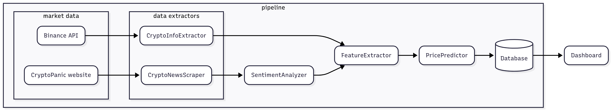

# BTC Prediction System

This is an automated Bitcoin direction prediction system that forecasts the direction of Bitcoin price (up/down) using an XGBoost Classifier. To generate the data needed for the forecast model, we periodically collect market data from Binance API, as well as collect market sentiment by web scraping for Bitcoin news using Selenium, then perform sentiment analysis of the collected news articles with a fine-tuned Hugging Face transformer model.  

The system is deployed using Docker and data storage is managed with SQLite for simplicity.

## Project Structure

## Core Components

- `data_extractor.py`  
  - **CryptoInfoExtractor:** Collect OHLCV from Binance API for 4 cryptocurrencies (BTC, ETH, SOL, XRP). Also collect other relevant data such as funding rate and open interest
  - **CryptoNewsScraper:** Scraping Bitcoin news from CryptoPanic.com using Selenium

- `models.py` 
  - **SentimentAnalyzer:** Classify the sentiment of the news articles as positive or negative based on their title and summary. This is achieved with FinBERT model (https://huggingface.co/ProsusAI/finbert) that we finetuned with a bitcoin news sentiment dataset. The fine-tuning procedure is stored in `finetune_sentiment.ipynb`
  - **PricePredictor:** Takes the extracted feature and generate a directional forecast (up/down). The XGBoost Classifier base model was trained on historical data in Jul-Oct 2023, and after the system deploys, it is retrained weekly by incorporating new data. The training procedure with historical data is stored in `train_XGBoost.ipynb`

- `feature_extractor.py`
  - **FeatureExtractor:** Generate additional features from the collected market and sentiment data

- `database_manager.py`
  - **DatabaseManager:** Handle connection to the database and provides various data storage/retrieval methods

- `pipeline.py`
  - **DataPipeline:** Handle the data flow between modules. Also handle scheduling and backfilling mechanism so that the system can run continuously

- `dashboard.py`
  - Display metrics on database and performance of the prediction model

